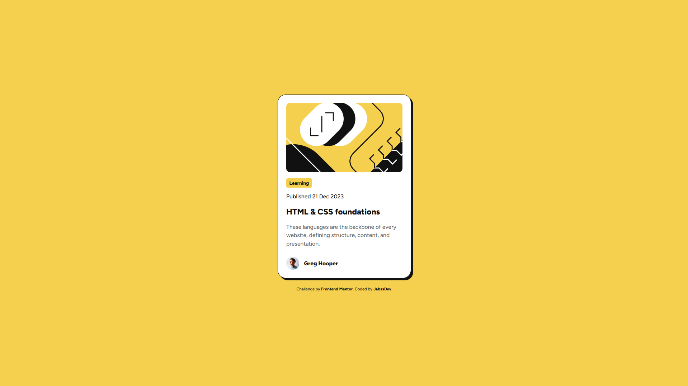

# Frontend Mentor - Blog preview card solution

This is a solution to the [Blog preview card challenge on Frontend Mentor](https://www.frontendmentor.io/challenges/blog-preview-card-ckPaj01IcS). Frontend Mentor challenges help you improve your coding skills by building realistic projects.

## Table of contents

- [Overview](#overview)
  - [Screenshot](#screenshot)
  - [Links](#links)
- [My process](#my-process)
  - [Built with](#built-with)
  - [What I learned](#what-i-learned)
  - [Continued development](#continued-development)
  - [Useful resources](#useful-resources)
- [Author](#author)

## Overview

### Screenshot



### Links

- Solution URL: [GitHub Repository](https://github.com/jabssdev/blog-preview-card)
- Live Site URL: [Live Demo](https://blog-preview-card-jabssdev.netlify.app/)

## My process

### Built with

- Semantic HTML5 markup
- CSS custom properties (CSS variables)
- Flexbox
- Modern CSS units (rem, clamp, dvh)
- Webpack 5 - Module bundler
- html-loader - For processing HTML templates
- MiniCssExtractPlugin - For CSS extraction
- Webpack Dev Server - For local development

### What I learned

Through this project, I strengthened my understanding of several key concepts:

**1. Semantic HTML with Proper Elements**

I learned to use the appropriate HTML5 semantic elements for better accessibility and SEO:

```html
<time datetime="2023-12-21" class="card-date">Published 21 Dec 2023</time>
```

**2. Security Best Practices for External Links**

Adding `rel="noopener noreferrer"` to external links prevents security vulnerabilities:

```html
<a href="https://google.github.io/styleguide/htmlcssguide.html" target="_blank" rel="noopener noreferrer"> HTML & CSS foundations </a>
```

**3. Responsive Typography with Clamp**

Using `clamp()` for fluid typography that scales smoothly across all screen sizes:

```css
:root {
	font-size: clamp(50%, 0.5vw + 50%, 62.5%);
}
```

**4. Accessibility with Focus States**

Ensuring keyboard navigation works properly with visible focus indicators:

```css
.attribution a:focus-visible {
	outline: 2px solid var(--color-gray-950);
	outline-offset: 2px;
}
```

**6. Webpack Configuration**

Configured Webpack to handle various assets and optimize for both development and production:

```javascript
{
	test: /\.html$/,
	use: ["html-loader"],
}
```

### Continued development

In future projects, I want to continue focusing on:

- **Advanced CSS**: Exploring CSS Grid layouts and container queries for more sophisticated responsive designs
- **Accessibility**: Implementing ARIA attributes and ensuring comprehensive keyboard navigation
- **JavaScript Frameworks**: Learning React to build more interactive and dynamic user interfaces
- **Performance Optimization**: Implementing lazy loading, code splitting, and advanced Webpack optimization techniques
- **Modern Build Tools**: Exploring Vite and other modern alternatives to Webpack
- **CSS Architecture**: Deepening understanding of BEM methodology and CSS Modules for better scalability

### Useful resources

- [Webpack Documentation](https://webpack.js.org/concepts/) - Essential for understanding module bundling and asset management. The guides on loaders and plugins were particularly helpful.
- [CSS-Tricks: A Complete Guide to Flexbox](https://css-tricks.com/snippets/css/a-guide-to-flexbox/) - Great visual reference for Flexbox properties and centering techniques.
- [MDN Web Docs: CSS Custom Properties](https://developer.mozilla.org/en-US/docs/Web/CSS/--*) - Comprehensive guide on using CSS variables effectively.
- [MDN Web Docs: clamp()](https://developer.mozilla.org/en-US/docs/Web/CSS/clamp) - Helped me understand fluid typography and responsive font sizing.
- [web.dev: Link rel="noopener"](https://web.dev/external-anchors-use-rel-noopener/) - Explained the security implications of external links and best practices.
- [Webpack html-loader](https://webpack.js.org/loaders/html-loader/) - Critical for understanding how to process HTML files and their assets in Webpack.

## Author

- LinkedIn - [@jabssdev](https://www.linkedin.com/in/jabssdev/)
- Frontend Mentor - [@jabssdev](https://www.frontendmentor.io/profile/jabssdev)
- Instagram - [@jabssdev](https://www.instagram.com/jabssdev/)
